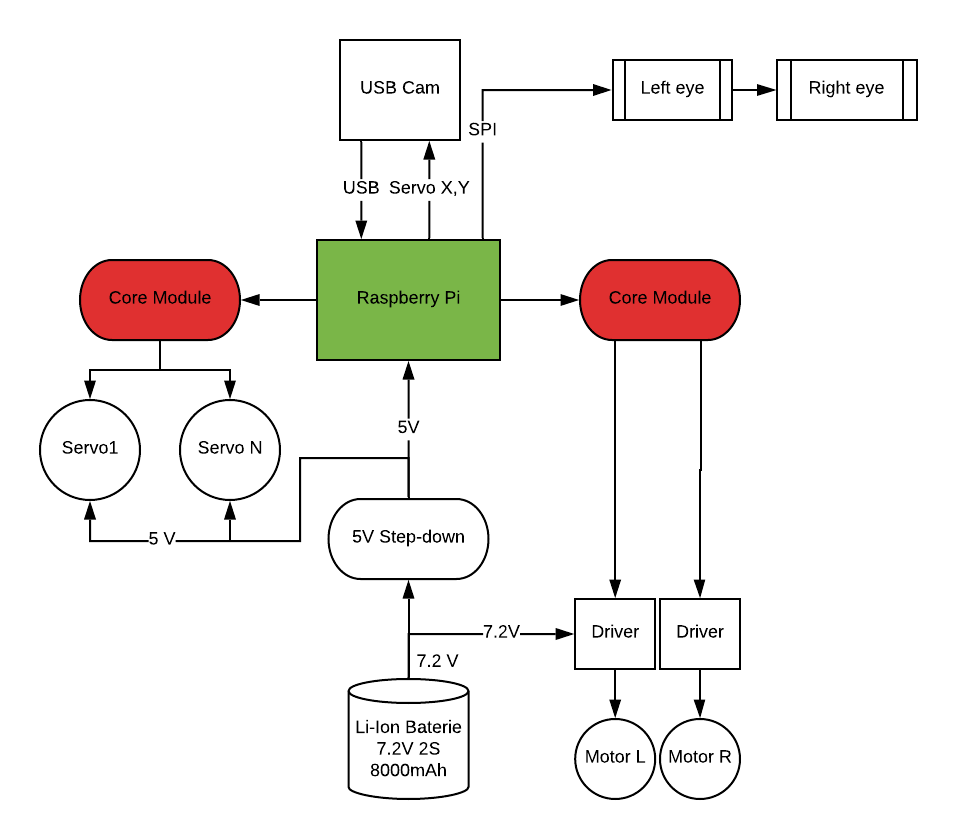

# Welcome to documentation to Robot Ronny!

This documentation is in the progress as we improve the Ronny Robot on every Hackathon, PiJam or other event.

## Block diagram

The hearth is Raspberry Pi. There are two BigClown Core Modules. One for controlling and smooth interpolation of 9 servos, the other for two DC motor drivers for the wheels.



## Running Services

On Raspberry Pi we use `pm2` to run different python and glue-logic scripts.

Use `pm2 list` to list current running services

List of running services

- node-red - NodeRED
- ...
- ...
- eyes - Python script to control eyes
- serveo - remote access

## Servo Core Module

Is connected over USB and uses virtual UART communication. It uses AT commands.

Firmware repository `rr-drive`.

Each received packet is signaled by shor red LED blink. When you hold down the button on core module, the servos are interpolated to default "safe" position saved in EEPROM (see `AT$SAVE`). This is useful for robot transport when Rpi is turned off or disconnected.

### AT Commands
- `AT$S0=70` - Set first servo (servo zero) to 70° angle
- `AT$S1=180`- Set second servo to 180° angle
- `AT$S1=90,15000`- Set second servo to 90° angle, set servo interpolation speed to 15 000 milliseconds per 180°
- `AT$STATUS` - Get values of last set servo angles
- `AT$SAVE` - Save current servo postions to EEPROM. This is used for "basic" posture when the robot has arms down. It is a safe state after Core Module boots up.
- `AT$HELP` - displays all commands including mapping servo index to GPIO pins.

## Motor Core Module

Is connected over USB and uses virtual UART communication. It uses AT commands.

Firmware repository `rr-wheels`

### AT Commands
- `AT$STOP`
- `AT$LEFT`
- `AT$RIGHT`
- `AT$FORWARD`
- `AT$BACKWARD`
- `AT$HELP`


## MQTT Topics
### Move
**Chassis**

topic: 
```
ronny/go/{forward, backward, left, right}
```
payload:
```
{"interval": 50, "speed", 100}
```
